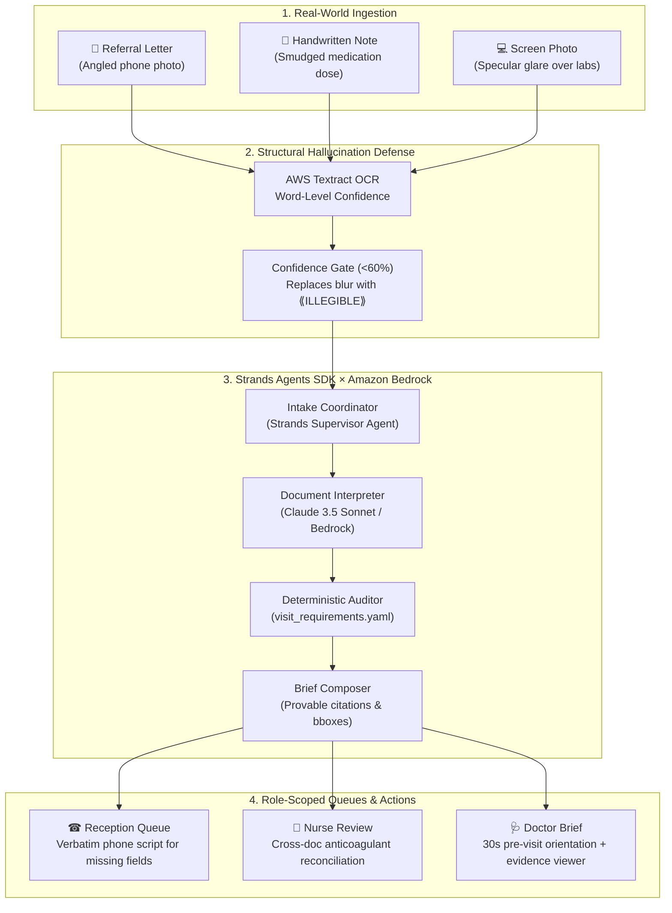

# 🩺 Anteroom — Ambient Clinical Intake Coordinator

[](https://www.python.org/downloads/)
[](https://github.com/strands-ai/strands-agents)
[](https://aws.amazon.com/bedrock/)
[]()
[](https://opensource.org/licenses/MIT)

> **"Anteroom checks tomorrow’s clinic list tonight, verifies whether scheduled appointments can actually proceed, and hands reception the exact three calls to make in the morning."**

Built for the **AWS × Strands Agents SDK Hackathon ("Agents for Humans")** — **Professional Agents Track**.

---

## 🚨 The Problem: The Burned Appointment Slot

In specialist outpatient care, consultations are not lost because electronic health records are too long. They are lost because pre-visit intake is fragmented, illegible, or incomplete:

1. A patient arrives for a scheduled 30-minute cardiology consultation.
2. The photographed referral letter gives history but omits the referral question.
3. The handwritten medication note has a smudged blood-thinner dose.
4. A phone photo of a hospital screen has glare obscuring renal lab values.
5. **The Clinical Consequence:** The consultant cannot safely make a management decision. A 30-minute slot becomes an administrative re-booking, capacity is burned, and the patient waits another month.

---

## 💡 The Solution: Ambient Intake Coordination

**Anteroom** runs ambiently between the clinic’s incoming documents and tomorrow's appointment calendar. It ingests messy real-world intake artifacts (angled phone photos, handwritten notes, photographed computer screens), passes them through a **hardware-confidence gate**, performs model-driven structured extraction using the **Strands Agents SDK**, deterministically audits the case against clinic policy, and routes role-specific work to the right person before the patient arrives.



---

## 🛡️ Structural Defense Against Hallucination

The single greatest safety failure mode in medical document AI is an LLM "helpfully" hallucinating an illegible dose.

```
       [ Smudged Photo: "Apixaban [blur] twice daily" ]
                              │
                              ▼
                 [ AWS Textract OCR Engine ]
                 Word: "Apixaban"  Confidence: 99.2%
                 Word: [Blur]      Confidence: 43.1% (<60%)
                              │
                              ▼
            [ Textract Confidence Gate (Threshold: 60%) ]
                              │
                              ▼
            [ Sanitized Text Fed to Strands Agent ]
            "Apixaban ⟪ILLEGIBLE⟫ twice daily"
                              │
                              ▼
            [ Bedrock Model (Claude 3.5 Sonnet) ]
            Physically impossible to invent "5mg"
            because the model never sees raw smudge pixels!
                              │
                              ▼
            [ Deterministic Clinical Policy Auditor ]
            Flagged: High-risk anticoagulant dose unstated.
            Escalation: Nurse queue + pharmacy verification.
```

### 🔬 The Hero Deduction: Cross-Document Clinical Reconciliation
Single-document OCR or generic LLM summaries fail at cross-document synthesis:
* Document A (Hospital discharge screen photo) states: *"Dose reduced on discharge"* — but specifies no number.
* Document B (Handwritten medication list) has the dose smudged out.
* **Anteroom's Deduction:** Holding both documents in memory, Anteroom alerts:
  > `[CRITICAL ALERT] Apixaban was changed according to 'Discharge summary', but no document states the current dose. Two independent sources checked and neither resolves it. Clarify before consultation.`

---

## 📊 Reliability Benchmark

Conducted against live Amazon Bedrock inference across repeated consecutive runs:

| Safety & Stability Metric | Target | Verified Live Result |
|---|---|---|
| **Hallucination Refusal Rate** | 0 invented doses | **100% (0 invented doses)** |
| **High-Risk Cross-Doc Reconciliation** | 100% detected | **100% Stable Detection** |
| **At-Risk Classification Consistency** | 100% `at_risk` | **100% Deterministic** |

---

## 🔒 Practice & Role-Scoped Authorization Model

Anteroom implements a zero-trust clinical authorization model where authentication is stubbed for the demo, but **authorization is rigorously enforced and tested**:

* **Practice Scoping:** Users from Practice A cannot access appointments belonging to Practice B (raises `AccessDenied` and logs security audit trail).
* **Role Scoping & Least Privilege:**
  * **Reception:** Views appointment logistics, missing contact/referral questions, and verbatim telephone call scripts. Strictly denied access to consultant clinical briefs.
  * **Nurse:** Clinical verification queue (reconciling unconfirmed medications, pharmacy contacts).
  * **Doctor:** 30-second pre-consultation brief, blocking safety alerts, and clickable bounding-box provenance for every extracted fact.
  * **Admin:** Practice manager view across all queues.

---

## 🚀 Quickstart & Interactive Console

### Prerequisites
* Python 3.13+
* AWS credentials configured (`AWS_ACCESS_KEY_ID`, `AWS_SECRET_ACCESS_KEY`, `AWS_DEFAULT_REGION`)

### Installation
```bash
# Clone the repository
git clone https://github.com/DrAhmed7887/anteroom.git
cd anteroom

# Install dependencies using uv
uv sync
```

### Run Tests
```bash
uv run env PYTHONPATH=. pytest
# 30 passed in 0.72s
```

### Launch the Streamlit Clinic Console
```bash
uv run streamlit run app.py
```

The console opens at `http://localhost:8501`:
1. **Switch Roles:** Test the perspective of Receptionist, Nurse, Doctor, or Practice Manager.
2. **Review Tomorrow's List:** Inspect `Marta Ruiz Delgado` (Cardiology New Consult, Score 32/100, At Risk) vs `Thomas Whitfield` (General Medicine, Score 100/100, Ready control case).
3. **Inspect the Confidence Gate:** Toggle word-level Textract confidence overlays (Green = survived, Red = deleted `<60%`).
4. **Visual Proof Viewer:** Click any clinical fact to see its exact coordinates highlighted on the source document.

---

## 🏗️ Repository Architecture

```
anteroom/
├── anteroom/
│   ├── agents.py           # Strands Agents interpreter & Bedrock orchestrator
│   ├── brief.py            # Clinician pre-visit brief composer
│   ├── config.py           # Configuration loaders
│   ├── extraction.py       # Pydantic extraction models
│   ├── highlight.py        # Visual bounding-box & confidence gate PIL highlighter
│   ├── mapping.py          # Deterministic clinical entity normalization
│   ├── ocr.py              # AWS Textract client & word confidence gate
│   ├── pipeline.py         # End-to-end assembly pipeline
│   ├── readiness.py        # Deterministic clinical policy auditor
│   ├── schemas.py          # Strict Pydantic contracts (Role, Severity, Gap, etc.)
│   └── store.py            # Practice-scoped authorization & persistence
├── app.py                  # Streamlit Clinic Console
├── config/
│   ├── field_aliases.yaml       # Clinical synonym dictionaries
│   └── visit_requirements.yaml  # Deterministic clinic readiness policies
├── data/
│   ├── store/              # Pre-computed appointment records & audit logs
│   └── synthetic/          # Realistic synthetic test documents (1-4)
├── docs/
│   ├── MVP_PRODUCT_DOCUMENT.md  # Comprehensive product specification
│   ├── SUBMISSION.md            # Hackathon Devpost submission text
│   └── benchmark_results.md     # Multi-run Bedrock reliability benchmark
├── scripts/
│   ├── benchmark_reliability.py # Automated Bedrock reliability benchmark
│   ├── make_synthetic_docs.py   # Synthetic image generator with glare & blur
│   └── seed_demo.py             # Practice & appointment seeder
└── tests/
    ├── test_authorization.py    # Zero-trust role & practice scoping tests
    ├── test_brief.py            # Pre-visit brief & formatting tests
    ├── test_clean_patient.py    # Clean patient control tests
    ├── test_highlight.py        # Visual proof & bounding-box tests
    └── test_readiness.py        # Deterministic policy & gap detection tests
```

---

## ⚖️ Clinical Safety Boundary

* Anteroom does **NOT** provide autonomous medical diagnoses.
* Anteroom does **NOT** recommend treatments or alter dosages.
* Anteroom does **NOT** perform emergency triage.
* Anteroom is strictly an **assistive pre-visit intake and completeness coordinator**.

---

## 👥 Authors & Acknowledgments

* **Dr. Ahmed Zayed** (MBBCh, MSc Candidate in Applied Health Informatics at RWTH Aachen; Founder of doctorIQ)
* **Gerhard**

Built with ❤️ using the **Strands Agents SDK** and **Amazon Bedrock**.
